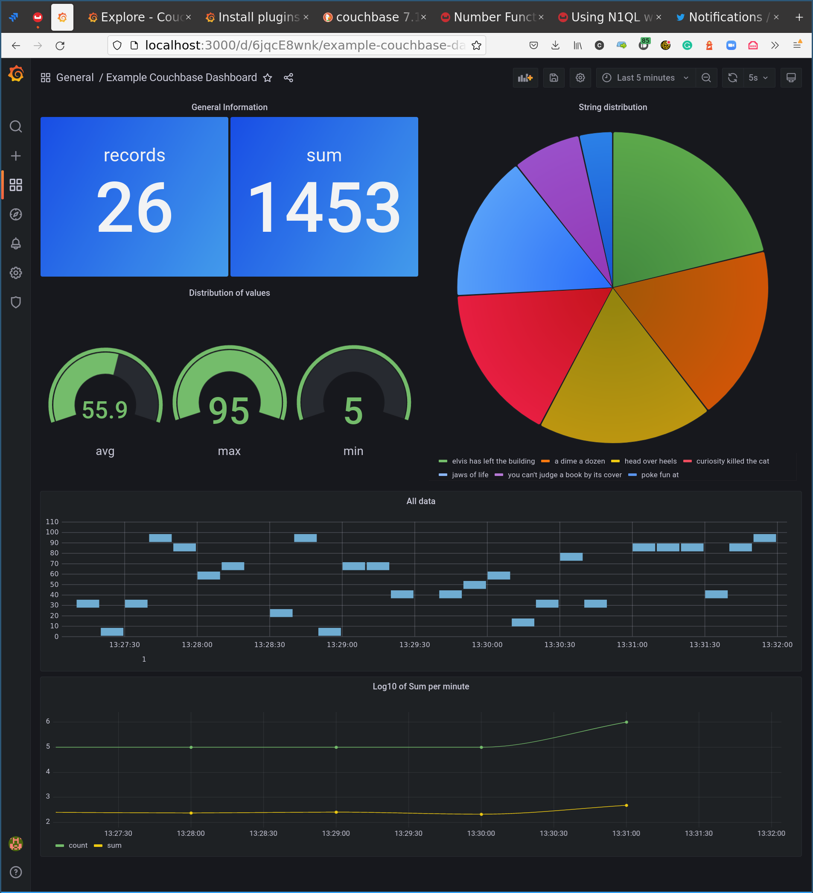

# Grafana Couchbase datasource plugin



This is a simple Grafana datasource plugin that allows querying time series and log data from Couchbase Clusters, inclding Capella clusters.

## Installation from sources
* Clone this repository and copy `couchbase` directory into your Grafana `plugins` directory.
* Set the following environment variables (or edit grafana configuration file according to documentation):
    - "GF_PLUGINS_ALLOW_LOADING_UNSIGNED_PLUGINS=couchbase"
    - "GF_PLUGIN_APP_TLS_SKIP_VERIFY_INSECURE=true"
* Restart grafana
* Add a new datasource in configuration and configure it with your cluster information.

## Usage
The datasource plugin provides two functions for time range filtering:
- `str_time_range(<fieldname>)` for filtering on RFC3339 dates
- `time_range(<fieldname>)` for filtering on millisecond timestamps

Both functions take the name of the field to be used for filtering.
Examples:

```sql
select count, time_string from test where str_time_range(time_string)
select count, timestamp from test where time_range(timestamp)
```

These are pseudo-functions, references to them are replaced with a set of `WHERE` filters on provided field by the plugin before the query is sent to the cluster.


## Development instructions 
Add `datasources/couchbase.yaml` with your datasource configuration:
```yaml
apiVersion: 1
datasources:
- name: Couchbase
  type: couchbase
  access: proxy
  jsonData:
    host: <...>
    username: <...>
  secureJsonData:
    password: <...>
```

Use `./run.sh` to start grafana in docker container with following mounts:
```yaml
    volumes:
    - ./couchbase:/var/lib/grafana/plugins/couchbase
    - ./datasources:/etc/grafana/provisioning/datasources
```

Open grafana at http://localhost:3000, use `admin` as both login and password. 
You don't need to setup a new password after you login despite grafana asking you to do that -- just reload the page.
